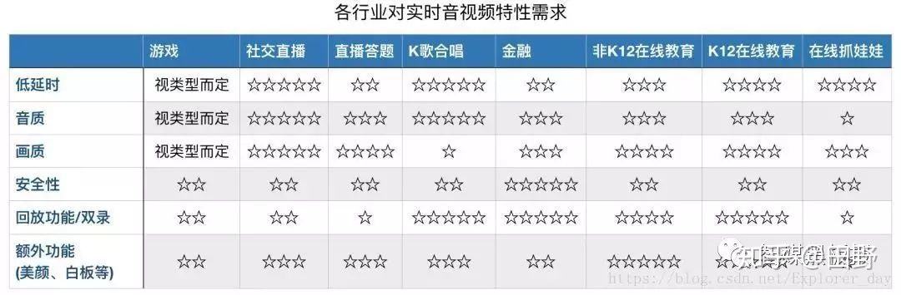
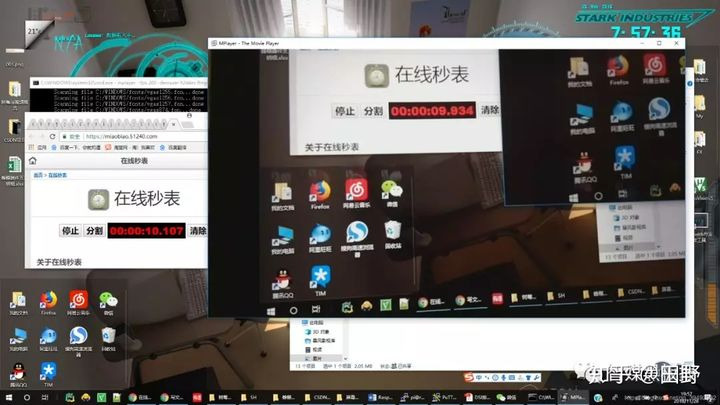
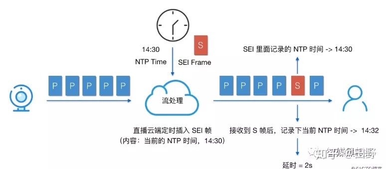
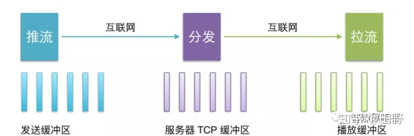

#[音视频常见问题分析和解决：延时和抖动](https://zhuanlan.zhihu.com/p/82854047)

##问题背景：

在上一篇文章讲了音视频一些疑难问题的排查，其中一个比较重要的原则就是要将
音视频作为一个系统来看待，问题有可能只是表现在播放端，但是根因有可能在编码端，也有可能发生在传输过程中。其实对于音视频有些问题的优化，有时也要整体优化，比如延时这种问题。

下面我将会分析延迟的概念，延迟的产生和类型、延迟的优化三大部分的内
容，最后再通过一两个小例子分享下我在解决延迟问题的优化实践。你可以根据自己的需要，选择性阅读。

---
###延迟抖动：

####延迟：
是网络传输中的一个重要指标，测量了数据从一个端点到另外一个端点所需的时间。一般我们用毫秒作为其单位。通常我们也把延迟叫做延时，但是延时有时还会表示数据包发送端到接受端的往返时间。这个往返时间我们可以通过网络监控工具测量，测量数据包的发送时间点和接受到确认的时间点，两者之差就是延时。单向时间就是延迟

####抖动：
由于数据包的大小，网络路由的路径选择等众多因素，我们无法保证数据包的延迟时间是一致的，数据包和数据包延迟的差异我们称为抖动。也就是说因为数据包的延时值忽大忽小的现象我们称为是抖动

---
###讨论
可以看出延迟会造成抖动，但是抖动并不完全等价于延迟，所以有时我们分析实际问题时还是要加以区分。

大学经常看直播球赛，记得舍友用笔记本看，球都进了，我这边用手机过了一会才看到刚才球进的画面。这就是典型延时场景，其中各个行业对延时的容忍度不一样，像K歌合唱就对低延时要求非常高。如果歌伴都唱完了上半句，你由于没有及时听到，下半句还没唱出来，对方是非常疑惑的。

但是我们也不能一味的追求低延时，低延时是好，但是会带来成本的上升。在实时传输领域有一个著名的三角理论。

成本我们可以理解为购买服务器需要的硬件成本、软件开发的人力成本和通讯带宽的租赁费用；延时就是上面理解的数据包端到端之间的时间差，质量可以理解为视频的清晰度和细节，音频的高保真以及数据的完备性。任何行业完成实时数据交互，都要受这三方面的因素的限制。如果过分追求低延时，要么我们要付出比较高的成本要么我们得下降我们的音视频质量。所以我们针对不同行业，选择一个用户能接受和不影响体验的延时即可。

###关于视频的实时性归纳为三个等级：
####伪实时：
视频消费延迟超过3 秒，单向观看实时，通用架构是 CDN + RTMP + HLS，现在基本上所有的直播都是这类技术；
####准实时： 
视频消费延迟 1 ~ 3 秒，能进行双方互动但互动有障碍。有些直播网站通过 TCP/UDP + FLV 已经实现了这类技术，YY 直播属于这类技术；
####真实时：
视频消费延迟< 1秒，平均 500 毫秒。这类技术是真正的实时技术，人和人交谈没有明显延迟感。QQ、微信、Skype 和 WebRTC 等都已经实现了这类技术。对于严格的音频通话，当延时低于200ms时，就会影响到用户体验。达到400ms对方用户就容易感知出来，1s以上的延迟对于交互式实时直播就不能接受了。下面有一个表格基本列举了不同业务对于低延时的大致要求，当然即使是同一个业务，应用在不同的场景下对于低延时要求也经常不一样，这就导致我们解决问题的技术手段也是不一样的。在视频监控业务下这种差异更大，对于一些司法、监狱和博物馆，实时性要求很高，希望出现问题后立即能进行报警和进行查看，但是对于一些景区直播和学校社区实时性的要求就低很多。

###延迟产生：

我们继续看下一个完整直播系统的示意图：

音视频从生产到消费的各个环节都需要花费时间来处理，这些时间之和就造成了视频观看方看的视频是视频产生方几秒之前产生的视频。我们对这些延时进行区分，会总结出以下四种类型的延时：

1. 处理延时：一般就是路由器要分析数据包头决定这个数据包要送到下一站花费的时间；

2. 排队延时：数据包从进入到路由器的发送队列到被发送之间经过的时间，路由排队算法和网络都会影响这部分延时。

3. 传输延时：将数据包传入到线路花费的时间，跟数据包的大小和带宽有关系。

4. 传播延时：是指数据包第一个bit位从发送端到接收端的时间，其和传输距离和传播速度有关系。

其实对于音视频系统，我们可以将上面讲述的三种延时归纳为下面几种：

设备端的延时：包括数据的采集、前处理、编码、解码、渲染等处理阶段花费的时间。也就是A1和A5花费的时间。

###音频部分：

音频从采集后，会经过模数转换，将传统的模拟信号转换成数字信号就会产生延时，一般在10ms级别；采集后，进行编码，采用不同的音频编码器也会产生不同的延时，以Opus为例，延时也在2.5ms-60ms级别，可以参考上篇文章分析。发送前还需要进行3A算法（AEC、ANS、AGC）的处理，又需要十几ms.

###视频部分：

从自然采光到成像，取决于CCD和CMOS的成像效率，不过一般也需要几十ms.对采集的RGB数据要进行YUV转换和编码，如果还有B帧会产生比较大的编码延时，紧接着播放端的渲染也是需要一定时间的。

无论音频还是视频，为了防止抖动我们一般会在播放端加上jitter buffer缓存，数据从进入到缓存到出缓存以及当发生丢包时，进行的一些传输算法处理也是需要一定的时间，大概会在几十毫秒到几百毫秒之间。

设备端和服务器的延时：也就是俗称的第一公里和最后一公里的延时，包括了A1到A2推流产生的延时和A5向A4拉流的延时。这里的延时跟设备端距离服务器的物理距离，服务器和设备端的网络运营商，设备的网速和带宽，设备端自己的负载都有密切关系。

服务器之间的延时：包含了音视频数据在网络上进行再次转码、切片、转封装和协议以及分发CDN等花费的时间，包含了A2到A4整个阶段花费的时间。这里要看设备的推流端和播放端是不是在同一个边缘节点，如果属于同一个边缘节点，那延时能小点。国内城市之间的传播延时也在几十毫秒，如果跨洲延时会达到百毫秒以上。

所以单就降低实时音视频系统延时一项内容，都不是靠只优化一个节点或者一个阶段就能达到你想要的预期效果，必须站在音视频整个系统来看待。

###延迟测量：

####测试方法1：

实际最简单的做法就是：我们让推流端也就是主播端比如手机或者IPC摄像头对着一个在线秒表，然后同时我们用手机或者桌面播放器播放该路视频，然后得到了在线秒表显示的时间，等稳定一段时间后我们将在实际线秒表的时间减去播放器显示的该时间，二者的差值就是当前的系统的延时。然后这种测试方法，每隔一段时间，测试多组，求其平均值就得到了当前负载下的音视频延时。

####测试方法2：

我们也可以在编码端的视频帧前面加上SEI帧，SEI的全称是补充增强信息（Supplemental Enhancement Infomation）,提供了一种向视频码流中增加额外私有信息的方法。我们可以隔一段时间就在I帧前面的SPS PPS后面增加SEI帧，私有信息就是这时我们编码器的NTP标准时间，当该SEI帧信息到达播放器端，我们再计算下本地的NTP时间。这样本地的值减去SEI的NTP时间，就是当前系统的延时。前提条件，编码器和播放器进行过NTP校时，保证毫秒级别的时间信息要一致。

注：对于有些播放器如果增加SEI信息，可能会导致播放失败，所以解码前我们可以将使用过的SEI帧丢掉。

###延迟优化：

经过以上的分析，我们就分析出延时产生的阶段和节点，这样优化延时就有了方法。延时会产生在：

1. 音视频数据的前处理；

2. 音视频数据的编解码；

3. 音视频数据的网络传输；

4. 为了防止抖动业务代码中的缓冲区，包括推流服务、转码服务、播放器的缓存等；

5. 音视频的渲染播放；

当然上面会产生延时的地方对于最终的延时影响权重是不一样的，其中数据的前处理、编解码、渲染对于延时影响比较小，而网络传输和业务代码的缓存对于延时影响非常大。所以优化也要结合你的业务有重点进行。

####优化思路1：
调整推流端和播放端的缓冲区大小，对于25fps的视频流，如果我们缓存25帧的数据，就会在播放时产生1s的延时。所以我们要动态调整我们的缓冲区，对于推流上行区我们如果带宽不够就会产生网络阻塞，这时发送端的数据就会积累，最终延时不断累加，导致延时变大。我们此时就需要有一套机制来能够预测带宽，降低发送码率，减低当前发送数据量，减少网络阻塞，等网络好的时候再继续增大数据发送量，增大码率。

上面说的这些算法有很多，其中WebRTC方案就采用了GCC算法，还有一些类似BBR的算法来实现上述想法。

对于播放端的缓存，当网络不好产生的延时比较大时，我们需要通过丢帧和加速播放方式快速消耗掉播放缓冲区的数据，从而消除累计的延时。

####优化思路2：
优化网络传输，如果实时性要求很高的场景，你如果选用基于TCP承载的网络传输协议，无论你怎么优化，也很难降低延时。因为TCP会进行三次握手，而且它会对每一次发送的数据进行确认，还要对丢包进行重传，所以这些限制很不适合降低延时。我们要优化传输协议，我们可以将基于TCP的RTMP、HLS协议切换到基于UDP的RTP、QUIC协议上，或者自己开发基于UDP的私有协议栈，这样我们就可以对一些TCP延时大的功能进行裁剪和修改，对于一些不关重要的数据进行丢弃，优先保障重要数据的传输。其中国内B站、虎牙直播，在线k12教育等都进行了类似的处理；

####优化思路3：
选择优质的CDN加速服务，保障传输的线路带宽和线路资源，一般都会提供测速选线、动态监测、智能路由等功能。

####优化思路4：
如果感觉自己的编解码，前期处理等花费时间比较多，我们就需要选择合适的音视频编解码器，进行算法调优降低延时，比如我们在播放端能支持硬解的优先选择硬解否则才选择软解。

上面所说的任何一种实践方法用一两篇文章都讲述不完，特别对于一些GCC、BBR等网络传输算法，依然是高校和大厂最前沿最热门的研究领域，需要用心学习才能落地到工程项目上，这里只是简单的提出，有兴趣的需要进一步搜索学习和实践。后面本公众号也会进行逐渐介绍这些算法，敬请期待。

###案例分享：

####案例1：

问题：

前一阵我们做了一个项目，就是将自家消费类摄像头的视频投屏到像Alexa的智能音箱上，当然音箱就是带屏幕那种，类似小度小度。实际测试发现，延时比较大，大概有七八秒钟的样子，但是对于Alexa这种智能音箱也就是播放器，我们能干预的很有限，毕竟推动亚马逊研发给你优化这些都是不太可能的，但是我们想把自家摄像头视频投屏到Alexa后，这样在他们商场上架我们产品可以加快我们的硬件海外出货速度，同时还可以增加我们视频云的套餐订阅量。

措施：

最后我们采取了优化转分发服务器缓存的做法，采取了服务端主动追帧和丢帧的策略使服务器端的缓存能够根据当前网络状态进行自动调节，让Alexa播放器的播放缓存总是处于基本饥饿状态，经过一番优化后，延时从七八秒降低到一二秒，达到了上架IPC摄像头的条件。

所以服务端和播放端的缓存优化是降低延时的一个比较重要手段。

####案例2：

问题：

还有一个项目采用了自动切换网络传输协议的措施来降低延时，摄像头的视频一般要推送到云服务器上，然后才能进行大规模的转发和分发。这是因为摄像头毕竟是嵌入式设备，并发量非常有限，能同时推送的视频路数也就一两路，如何想无限制进行分发和允许多客户端同时观看，就需要先让摄像头的视频上云到服务端的流媒体，再进行大规模的分发和转发，这也是视频监控的基本玩法。但是我们摄像头以前只支持TCP长链接方式向服务器推流，这样当网络不好就会丢包重传，延时也逐渐积累增大。甚至网络非常不好时，延时会达到几十秒，用户体验很不好。

措施：

我们流媒体服务端会收集播放器的延时数据和丢包，然后当达到一定条件，我们通过信令服务器进行传输协议切换，重新让摄像头推流。将TCP推流改成UDP推流，我们在流媒体服务器端重新实现组包和增加丢帧策略，降低播放端延时，效果最后也得到了客户的满意。