#[C++函数调用过程深入分析](https://blog.csdn.net/fu_zk/article/details/9798185?utm_medium=distribute.pc_relevant.none-task-blog-2~default~baidujs_title~default-0.control&spm=1001.2101.3001.4242)

##1. 引言
>函数调用的过程实际上也就是一个中断的过程，那么C++中到底是怎样实现一个函数的调用的呢？参数入栈、函数跳转、保护现场、回复现场等又是怎样实现的呢？本文将对函数调用的过程进行深入的分析和详细解释，并在VC 6.0环境下进行演示。分析不到位或者存在错误的地方请批评指正，请与作者联系。
　　首先对三个常用的寄存器做一下说明，EIP是指令指针，即指向下一条即将执行的指令的地址；EBP为基址指针，常用来指向栈底；ESP为栈指针，常用来指向栈顶。
　　看下面这个简单的程序并在VC 6.0中查看并分析汇编代码。

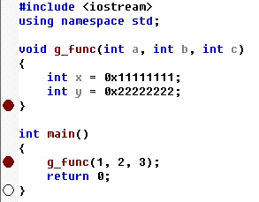

##2. 函数调用
>g_func函数调用的汇编代码如图2：

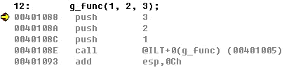

>首先是三条push指令，分别将三个参数压入栈中，可以发现参数的压栈顺序是从右向左的。这时我们可以查看栈中的数据验证一下。如图3所示，从右边的实时寄存器表中我们可以看到ESP（栈顶指针）值为0x0012FEF0，然后从中间的内存表中找到内存地址0x0012FEF0处，我们可以看到内存中依次存储了0x00000001（即参数1），0x00000002（即参数2），0x00000003（即参数3），即此时栈顶存储的是三个参数值，说明压栈成功。

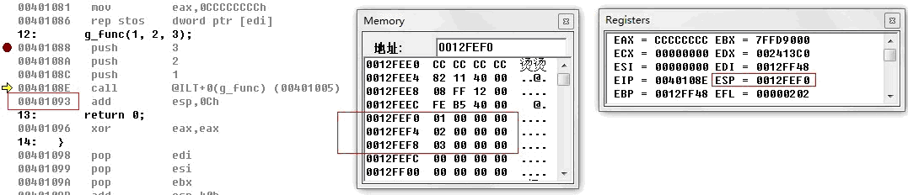

>然后可以看到call指令跳转到地址0x00401005，那么该地址处是什么呢？我们继续跟踪一下，在图4中我们看到这里又是一条跳转指令，跳转到0x00401030。我们再看一下地址0x00401030处，在图5中可以看到这才是真正的g_func函数，0x00401030是该函数的起始地址，这样就实现了到g_func函数的跳转。

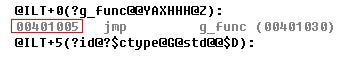
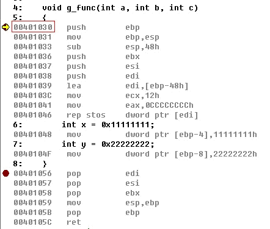

##3. 保存现场          
>此时我们再来查看一下栈中的数据，如图6所示，此时的ESP（栈顶）值为0x0012FEEC，在内存表中我们可以看到栈顶存放的是0x00401093，下面还是前面压栈的参数1,2,3，也就是执行了call指令后，系统默认的往栈中压入了一个数据（0x00401093），那么它究竟是什么呢？我们再看到图3，call指令后面一条指令的地址就是0x00401093，实际上就是函数调用结束后需要继续执行的指令地址，函数返回后会跳转到该地址。这也就是我们常说的函数中断前的“保护现场”。这一过程是编译器隐含完成的，实际上是将EIP（指令指针）压栈，即隐含执行了一条push eip指令，在中断函数返回时再从栈中弹出该值到EIP，程序继续往下执行。

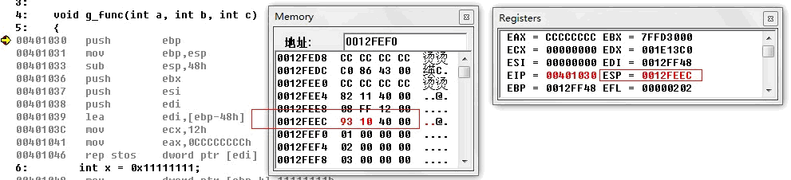

>继续往下看，进入g_func函数后的第一条指令是push ebp，即将ebp入栈。因为每一个函数都有自己的栈区域，所以栈基址也是不一样的。现在进入了一个中断函数，函数执行过程中也需要ebp寄存器，而在进入函数之前的main函数的ebp值怎么办呢？为了不被覆盖，将它压入栈中保存。
下一条mov ebp, esp 将此时的栈顶地址作为该函数的栈基址，确定g_func函数的栈区域（ebp为栈底，esp为栈顶）。
再往下的指令是sub esp, 48h，指令的字面意思是将栈顶指针往上移动48h Byte。那为什么要移动呢？这中间的内存区域用来做什么呢？这个区域为间隔空间，将两个函数的栈区域隔开一段距离，如图7所示。而该间隔区域的大小固定为40h，即64Byte，然后还要预留出存储局部变量的内存区域。g_func函数有两个局部变量x和y，所以esp需移动的长度为40h+8=48h。

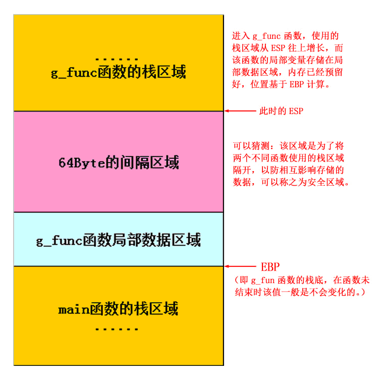

>接下来的几行指令（如下）是将刚才留出的48h的内存区域赋值为0CCCCCCCCh。
00401039   lea        edi,[ebp-48h]
0040103C   mov      ecx,12h
00401041   mov            eax,0CCCCCCCCh
00401046   rep stos    dword ptr [edi] 。
接下来三条压栈指令，分别将EBX，ESI，EDI压入栈中，这也是属于“保护现场”的一部分，这些是属于main函数执行的一些数据。EBX，ESI，EDI分别为基址寄存器，源变址寄存器，目的变址寄存器。

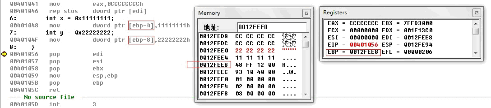
>　此时我们对整个内存区域中存储的内容应该非常清晰了（如图9所示）。

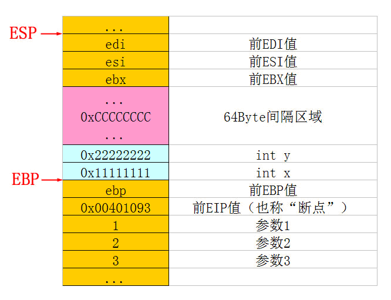

##4. 恢复现场
>这时子函数部分的代码已经执行完，继续往下看，编译器将会做一些事后处理的工作（如图10所示）。首先是三条出栈指令，分别从栈顶读取EDI，ESI和EBX的值。从图9的内存数据分布我们可以得知此时栈顶的数据确实是EDI，ESI和EBX，这样就恢复了调用前的EDI，ESI和EBX值，这是“恢复现场”的一部分。

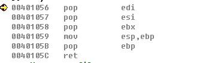

>第四条指令是mov esp, ebp 即将ebp的值赋给esp。那这是什么意思呢？看看图9的内存数据分布，我们就能很明白了，这条语句是让ESP指向EBP所指的内存单元，也就是让ESP跳过了一段区域，很明显跳过的恰好是间隔区域和局部数据区域，因为函数已经退出了，这两个区域都已经没有用处了。实际上这条语句是进入函数时创建间隔区域的语句 sub esp, 48h的相反操作。
再往下是pop ebp，我们从图9的内存数据分布可以看出此时栈顶确实是存储的前EBP值，这样就恢复了调用前的EBP值，这也是“恢复现场”的一部分。该指令执行完后，内存数据分布如图11所示。

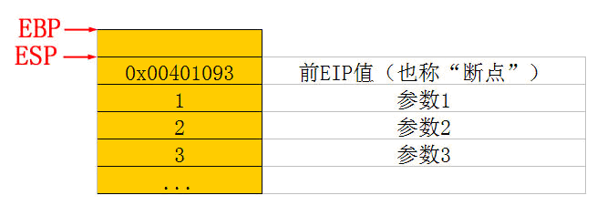

>再往下是一条ret指令，即返回指令，他会怎么处理呢？注意在执行ret指令前的ESP值和EIP值（如图12所示），ESP指向栈顶的0x00401093，EIP的值是0x0040105C（即ret指令的地址）

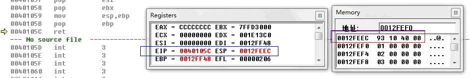

>执行ret指令后我们来查看ESP和EIP值（如图13所示），此时ESP为0012FEF0，即往下移动了4Byte。显然此处编译器隐含的执行了一条pop指令。再来看一下EIP的值，变为了0x00401093，这个值怎么这么熟悉呢！它实际上就是栈顶的4Byte数据，所以这里隐含执行的指令应该是pop eip。而这个值就是前面讲到过的，在调用call指令前压栈的call的下一条指令的地址。从图13中可以看出，正是因为EIP的值变成了0x00401093，所以程序跳转到了call指令后面的一条指令，又回到了中断前的地方，这就是所谓的恢复断点。

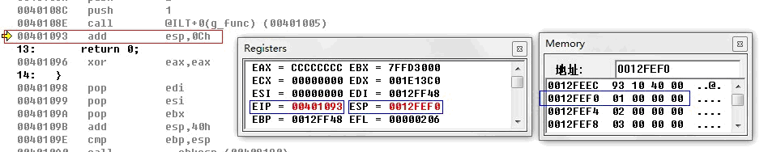

>还没有完全结束，此时还有最后一条指令add esp, 0Ch。这个就很简单了，从图13中可以看出现在栈顶的数据是1，2，3，也就是函数调用前压入的三个实参。这是函数已经执行完了，显然这三个参数没有用处了。所以add esp, 0Ch就是让栈顶指针往下移动12Byte的位置。为什么是12Byte呢，很简单，因为入栈的是3个int数据。这样由于函数调用在栈中添加的所有数据都已清除，栈顶指针（ESP）真正回到了函数调用前的位置，所有寄存器的值也恢复到了函数调用之前