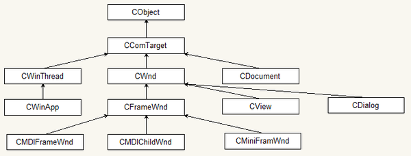
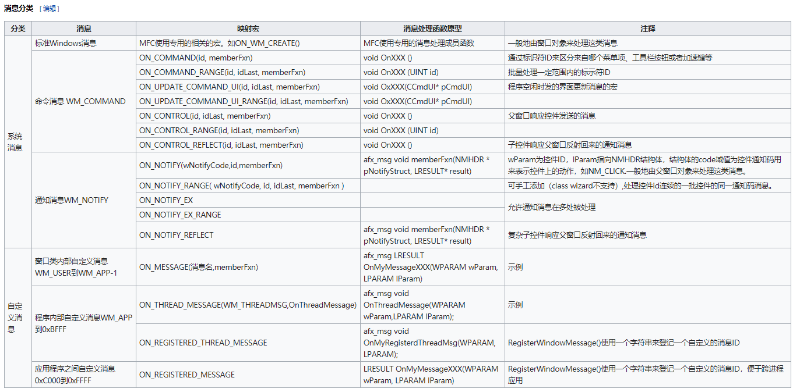

#[MFC](https://zh.wikipedia.org/wiki/MFC_(%E5%BE%AE%E8%BB%9F))
>微软基础类库（英语：Microsoft Foundation Classes，简称MFC）是一个微软公司提供的类库（class libraries），以C++类的形式封装了Windows API，并且包含一个（也是微软产品的唯一一个）应用程序框架，以减少应用程序开发人员的工作量。其中包含的类包含大量Windows句柄封装类和很多Windows的内建控件和组件的封装类

##MFC优点
>MFC的主要优点是可以用面向对象的方法来调用Windows API，以及能够更加便捷地开发应用程序。MFC将很多应用程序开发中常用的功能自动化，并且提供了文档框架视图结构和活动文档这样的便于自定义的应用程序框架。同时，在Visual C++内部也内建了很多对MFC的例如类向导这样的支持以减少软件开发的时间，使用类向导可以快速生成Hello World程序

##MFC缺点
>虽然MFC的源代码对用户是完全开放的，但是MFC的一些封装过程过于复杂，以致于新用户很难迅速掌握MFC的应用程序框架，以及在调试中定位问题的位置。同时，很多MFC对象不是线程安全的，致使在跨线程访问MFC对象时需要编写额外的代码。另外，MFC的很多类依赖于应用程序向导生成的代码，使得在使用Visual C++中其他类型的应用程序向导生成的工程中添加MFC支持的难度大大增加

##MFC启动
>基于MFC开发的应用程序在启动时，Windows操作系统：
>>1. 首先调用WinMain函数（位于appmodul.cpp中，封装到mfc80.dll（VS2005版）），WinMain函数内调用了AfxWinMain函数。
>>2. AfxWinMain函数（位于WinMain.cpp中）调用了
>>>1. 该应用程序自定义的App类（这个类派生于CWinApp的，CWinApp又是派生于CWinThread，因此代表了应用程序的主线程）的InitInstance函数，该函数注册并创建窗口（通过AppUI2.cpp中的ProcessShellCommmand函数)，然后ShowWindow、UpdateWindow;
>>>2. CWinThread的InitInstance函数；
>>>3. CWinThread的Run函数（位于thrdcore.cpp中）。该函数内部是Windows的消息循环。 当应用程序收到WM_QUIT消息后，CWinThread::Run函数返回，紧接着CWinThread::ExitInstance被调用，该函数可被覆盖。程序至此退出运行。 消息循环是一个for(;;)的死循环，该死循环内部包含了一个do...while的循环结构。while循环条件是调用PeekMessage函数的返回值，如果当前UI线程消息队列为空就返回到外层的死循环；while循环体内做两件事：
>>>>1. PumpMessage()。实际调用AfxInternalPumpMessage函数实现其功能：GetMessage()、AfxPreTranslateMessage()、TranslateMessage()、DispatchMessage().即：从UI线程消息队列移除一条消息、遍历该消息的CWnd类直到该窗口的各级别父窗口的CWnd类以提供预处理该消息的机会、如果该消息是按键消息则翻译为WM_CHAR消息、把该消息给相应的窗口函数。
>>>>2. IsIdleMessage()：实际调用了AfxInternalIsIdleMessage函数，对于WM_PAINT、WM_SYSTIMER、以及光标位置没有变化的WM_MOUSEMOVE或WM_NCMOUSEMOVE，为Idle Message。
>>>4. 各个窗口函数（WndProc）内部首先获取对应当前窗口句柄的CWnd类的指针，然后调用AfxCallWndProc函数

###应用程序结束
>如果是点击了IDOK按钮，默认是调用OnOK()，然后是OnDestory()，最后是PostNcDestroy()
如果点击IDCANCEL按钮，默认调用OnCancel()，然后是OnDestory()，最后是PostNcDestroy()
如果点击右上角的关闭按钮：先OnClose()，然后是OnCancel()，再然后是OnDestory() ，最后是PostNcDestroy()

###消息分类

