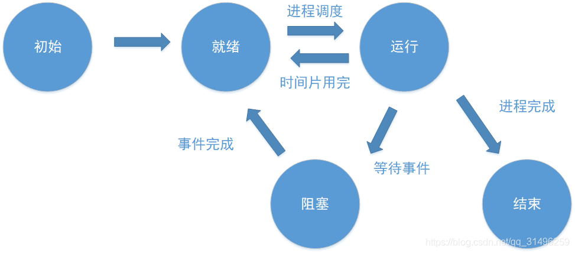

#[线程和进程的区别](https://blog.csdn.net/qq_31496259/article/details/106079626)
##1、进程和线程
>什么是进程？进程有哪些基本状态？关系是什么？
进程是程序的一次执行过程，是一个动态概念，是程序在执行过程中资源分配和管理的基本单位，每一个进程都有一个自己的地址空间，至少有 5 种基本状态，它们是：初始态，执行态，等待状态，就绪状态，终止状态。它们之间的关系如下图所示：

##什么是线程？进程和线程的关系？
>线程可以看做轻量级的进程，是处理机调度和分派的基本单位，它可与同属一个进程的其他的线程共享进程所拥有的全部资源。
线程是进程的一部分。
一个线程只能属于一个进程，而一个进程可以有多个线程，但至少有一个线程。。

##进程和线程的区别？
>在支持多线程的系统中，进程是资源分配的单位（如存储器、打开文件等，不含处理机）。线程是处理机调度单位，但不是资源的分配单位。在操作系统中能同时运行多个进程；而在同一个进程中有多个线程同时执行（通过CPU调度，在每个时间片中只有一个线程执行）。每个进程都有独立的代码和数据空间（程序上下文），进程之间切换开销大；线程可以看做轻量级的进程，只拥有必不可少的资源，如：线程状态、寄存器上下文和栈，同一进程的各线程间共享进程的所有资源，线程之间切换的开销小。线程同样具有就绪、阻塞和执行等基本状态。通信：进程间通信复杂。线程间可以直接读写进程数据段（如全局变量）来进行通信，但需要进程同步和互斥手段的辅助，以保证数据的一致性。

##什么时候用多线程?什么时候用多进程？
>需要频繁创建销毁的优先用线程。
需要进行大量计算的优先使用线程。
可能要扩展到多机分布的用进程，多核分布的用线程。
相关性强的操作优先使用线程，相关性弱的操作优先使用进程。

##2、互斥与同步
>C/C++中多线程有几种锁？
线程之间的锁有：互斥锁、条件锁、自旋锁、读写锁、递归锁。一般而言，锁的功能越强大，性能就会越低。
>>互斥锁：实现共享资源互斥访问。在某一时刻，只有一个线程可以获取互斥锁，在释放互斥锁之前其他线程都不能获取该互斥锁。如果其他线程想要获取这个互斥锁，那么这个线程只能以阻塞方式进行等待。
条件锁：条件锁就是所谓的条件变量，条件变量可以让某一个线程处于阻塞状态，一旦条件满足，它会以“信号量”的方式唤醒一个因为该条件而被阻塞的线程。
自旋锁：与互斥锁不同的地方是，如果一个线程想要获取一个被使用的自旋锁，那么它会一致占用CPU请求这个自旋锁使得CPU不能去做其他的事情，直到获取这个锁为止；如果是互斥锁，CPU会处理其他事务不会一直请求该锁。
读写锁：涉及到对一些共享资源的读和写操作，且写操作没有读操作那么频繁。其互斥原则为，读-读能共存；读-写不能共存；写-写不能共存。

##什么是信号量机制？
>信号量（Semaphore）是一种控制多线程（进程）访问共享资源的同步机制。信号量可以用来实现互斥锁。信号量有两个核心操作，P和V：
P操作，原子减少S，然后如果S < 0，则阻塞当前线程。
V操作，原子增加S，然后如果S <= 0，则唤醒一个阻塞的线程。